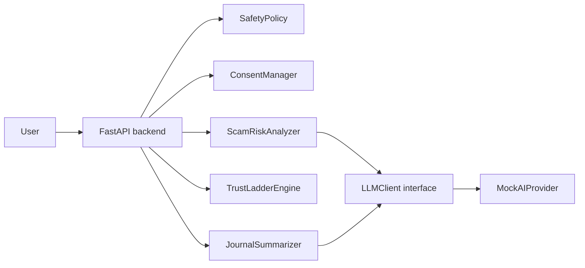

# Anti-Dating-App-Scam

AI-SlowMatch is a prototype architecture for AI-assisted anti-dating-scam and relationship-trust infrastructure. It is not a dating marketplace and not a personality scoring system. The goal is to help people slow down risky online intimacy, notice scam patterns, preserve autonomy, and move toward real-world trust only through consent-based, low-pressure steps.

## Problem Statement

Modern online dating safety problems are part of a broader chain: social atomization, weaker relational intermediaries, platformized intimacy, marketized matching logic, gender antagonism, mutual risk perception, and trust deficit. This creates room for scams, manipulation, defensive filtering, and the exit of sincere users.

AI-SlowMatch explores whether AI can act as restrained trust infrastructure rather than a love oracle. It supports risk awareness, uncertainty-aware explanations, trust-ladder progression, and privacy-first education.

## What The System Does

- Analyzes pasted dating-app conversations for scam risk signals.
- Explains uncertainty and missing information without accusing anyone.
- Recommends slow, low-risk next steps.
- Evaluates relationship progress through a trust ladder.
- Summarizes relationship-risk journal events over time.
- Provides education and governance documents for safer design.

## What The System Refuses To Do

- No public personality scores or social-credit style ranking.
- No deterministic "good person" or "bad person" labels.
- No hidden scraping or cross-platform data ingestion without consent.
- No stalking, doxxing, hacking, impersonation, harassment, or revenge advice.
- No addictive swiping, engagement farming, or paid anxiety loops.
- No advice to send money to online-only romantic contacts.

## Architecture



## Quickstart

```bash
python -m pip install -e ".[dev]"
uvicorn anti_dating_scam.main:app --reload
```

Open the API docs at `http://127.0.0.1:8000/docs`.

## API Examples

Health:

```bash
curl http://127.0.0.1:8000/health
```

Risk analysis:

```bash
curl -X POST http://127.0.0.1:8000/risk/analyze \
  -H "Content-Type: application/json" \
  -d '{
    "conversation_text": "I love you already. Please send gift cards for my emergency.",
    "user_notes": "We met yesterday.",
    "consent_confirmed": true
  }'
```

Trust ladder:

```bash
curl -X POST http://127.0.0.1:8000/trust-ladder/evaluate \
  -H "Content-Type: application/json" \
  -d '{
    "current_stage": "LOW_PRESSURE_CHAT",
    "observed_events": ["asked for money", "ignored my boundary"],
    "consent_confirmed": true
  }'
```

Journal summary:

```bash
curl -X POST http://127.0.0.1:8000/journal/summarize \
  -H "Content-Type: application/json" \
  -d '{
    "entries": [
      {"event_text": "Asked for money"},
      {"event_text": "Refused video call"},
      {"event_text": "Respected my boundary later"}
    ],
    "consent_confirmed": true
  }'
```

## Testing

```bash
python -m compileall src
pytest
```

## Roadmap

- Phase 0: docs and architecture.
- Phase 1: local scam-risk analyzer prototype.
- Phase 2: FastAPI endpoints and mock AI provider.
- Phase 3: optional frontend dashboard under `apps/web`.
- Phase 4: privacy-preserving local-first storage.
- Phase 5: evaluation with synthetic and consented data only.

## Ethics Disclaimer

This is a risk-support prototype, not legal, criminal, psychological, or relationship judgment. Outputs should be treated as cautious decision support based only on submitted information. Users should seek professional, legal, platform, or emergency help when appropriate.
