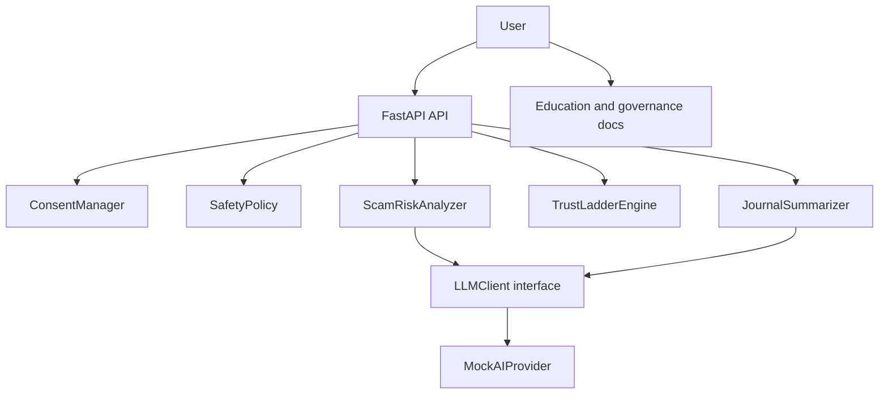
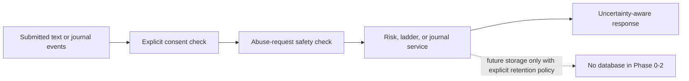
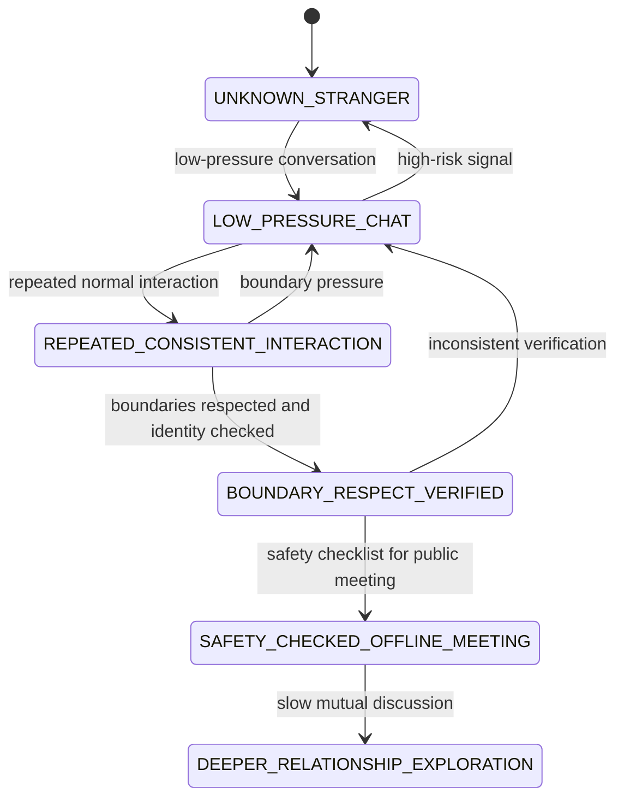
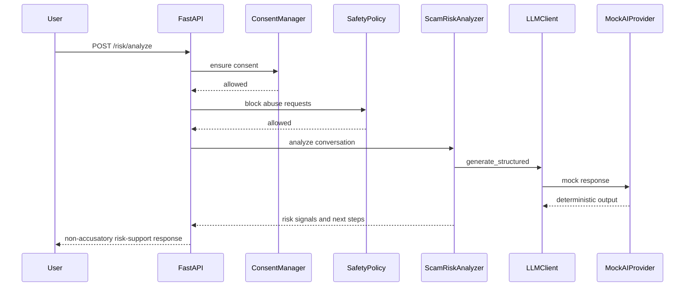

# System Architecture

AI-SlowMatch is a prototype architecture. The current implementation is a minimal FastAPI backend with deterministic services and a mock AI provider. A frontend is intentionally deferred to Phase 3 under `apps/web` so the safety model and API contracts can stabilize first.

## High-Level System Diagram

## Data Flow Diagram

## Trust Ladder State Machine

## AI Risk-Analysis Sequence

## Frontend Plan

No frontend is created in this phase. A future `apps/web` dashboard should be small and utilitarian:

- paste conversation text;
- show risk signals, uncertainty, and next steps;
- show trust ladder stage and safety checklist;
- support local-only journal entries;
- expose delete/export controls before persistent storage is introduced.
