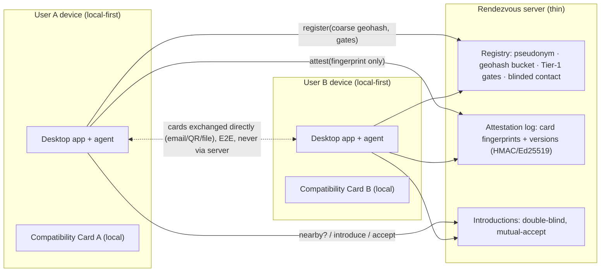

# Rendezvous Matchmaking Server Plan (Nearby Discovery + Card Attestation)

Agent-facing technical detail. English-only per the bilingual rule in `AGENTS.md`
(technical/internal doc). Owner decision 2026-07-06; recorded as ADR-012 in
`DECISION_RECORDS.md`. This **amends the scope** of `docs/11_compatibility_matching_plan.md`
§0: the peer-to-peer card exchange remains the core, but an *optional online rendezvous
server* is added so two strangers **nearby** can discover each other — something pure P2P
cannot do. The server is deliberately thin: it is a bulletin board and a notary, never a
profile database.

## 0. The one-sentence contract

> All personality/profile/chat data stays on the user's device. The server only ever
> holds: a pseudonym, a coarse location bucket, minimal Tier-1 gate fields, a contact
> channel (hidden until mutual accept), and cryptographic **fingerprints** of
> compatibility cards — never the cards themselves.

## 1. Why a server at all (and what it must never become)

- **Gap it fills:** `docs/11` requires the two people to already be in contact. Nearby
  discovery for strangers is impossible without *some* shared meeting point.
- **What it adds:** (a) "who else nearby is looking, with mutual basic filters"; (b)
  double-blind introductions; (c) **tamper-evidence** for the cards people then exchange
  directly (the owner's "prevent privately altering / crafting a perfect persona"
  requirement).
- **What it must never become:** a profile store, a discovery feed with photos/bios, a
  scoring/ranking engine (ADR-009), or a data-collection funnel (`06_data_governance.md`).
  Matching logic stays local; the server gates only on location bucket + mutual Tier-1
  ranges.

## 2. Architecture

Key flow decisions (defaults chosen, stated per the owner's "pick defaults" rule):

1. **Client-side geohash.** The app derives a *coarse* geohash locally (default precision
   4 ≈ a ~39×20 km cell — metro-area granularity) and sends only that string. Raw
   coordinates never leave the device. Finer precision is a user opt-in, never a default.
2. **Both sides need an attested card before they can see anyone.** No browsing without
   skin in the game — this kills drive-by profile shopping and scraping.
3. **Double-blind introductions.** `nearby` returns pseudonym + bucket + attestation
   summary only. Contact channels are revealed *only after both sides accept* an
   introduction.
4. **Cards travel person-to-person, not through the server.** After a match, the app
   auto-composes the delivery (email first; QR/file per `docs/11`), encrypted to the
   recipient. The server never sees card content — it can only verify fingerprints.

## 3. Attestation protocol (the anti-"perfect persona" mechanism)

- On every card save the app computes `fingerprint = sha256(canonical_json(card))`
  (reuses `reports/canonical_json.py`) and submits **only the fingerprint**.
- Server records `{pseudonym, fingerprint, version_n, attested_at}` and returns a signed
  attestation token (P0: HMAC-SHA256 with a server secret; P1: Ed25519 so clients can
  verify offline).
- When an introduction is created, the server **locks both parties' current attested
  fingerprints** into the introduction record.
- On receiving a card by email, the recipient's app recomputes the hash and checks it
  against the locked fingerprint. Any post-match edit → mismatch → flagged.
- The match packet includes the counterpart's **attestation history summary** (first
  attested, last attested, version count) as *plain facts*: "this card was attested 40
  minutes ago and rewritten 9 times" is visible context, never converted into a score.

**Honest limits (must be shown in UI, mirrors ADR-008):** attestation proves *integrity
and history*, not *truth*. It prevents silent post-match editing, per-target persona
swapping, and backdating. It cannot prove the card's content is true, complete, or that
a person is safe. Copy this disclaimer pattern from `reports/verifier.py`.

## 4. Threat model

| Threat | Mitigation |
|---|---|
| Edit card after match to fit the other person | Fingerprint locked at introduction; mismatch detected on receipt |
| Different persona per target | Same pseudonym has one attested card history; per-intro locking makes divergence visible |
| Rapid persona churn before matching | Version count + timestamps shown as facts in match packet |
| Fabricated persona from day one | **Not preventable by cryptography** — mitigated by the anti-scam pillar (risk analyzer, trust ladder) and the disclaimer |
| Location stalking | Coarse client-side geohash only; no raw coordinates server-side; no per-user precise queries; finer precision opt-in |
| Profile scraping | No cards on server; nearby requires own attested card; rate limits (P2) |
| Contact-info harvesting / harassment | Contact hidden until mutual accept; declined pairs cannot re-introduce; block/report (P2) |
| Server compromise | Worst case leaks pseudonyms, coarse buckets, gate ranges, contact channels, fingerprints — **not** profiles, portraits, or chats |
| Server operator abuse | Server cannot rank or read anyone; open-source server code; federation option (P3) |

## 5. What the server stores vs. never stores

| Stored (minimal) | Never stored |
|---|---|
| Pseudonym (no real names — apex rule) | Real name, photos, bio text |
| Coarse geohash bucket (client-derived) | Raw coordinates / location history |
| Tier-1 gate values + seeking ranges | Tier-2 content (values, goals, styles) |
| Contact channel (hidden until mutual accept) | Chat history, self-portrait, vault data |
| Card fingerprints + attestation timestamps | Card content in any form |
| Introduction state (pending/matched/declined) | Comparison results, scores (none exist) |

Deletion: unregister must delete the registration, attestation history, and open
introductions (`06_data_governance.md` deletion rule applies to the server too).

## 6. Build phases

- **P0 — prototype (this repo, done in this change):** `src/anti_dating_scam/matchmaking/`
  engine module (stdlib-only: geohash, HMAC attestation, in-memory rendezvous) +
  `/matchmaking/*` FastAPI routes behind the existing optional local API (ADR-010) +
  tests. No deployment, no real email sending, no persistence.
- **P1 — real crypto:** Ed25519 attestation keys (clients verify offline), X25519 sealed
  cards for e-mail transport, `cryptography` as an optional `[matchmaking]` dependency.
- **P2 — hosting hardening:** persistent store with deletion, rate limiting, block/report,
  TLS deployment on a small VPS/container, abuse monitoring that is *not* surveillance.
- **P3 — product integration:** GUI screens (register/nearby/introductions), automatic
  email composition on match, QR fallback, optional federation of rendezvous servers.

## 7. Non-goals (hard lines, restating existing ADRs)

- No compatibility scoring or ranking server-side or client-side (ADR-009).
- No photos/feeds — this is not a swiping app; discovery yields an *introduction*, and the
  real work stays the local card comparison + trust ladder.
- No background location tracking; location is a value the user types/derives per update.
- No scraping, no cross-platform ingestion, no hidden data collection.
